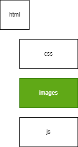

# hello-world

My first repository on GitHub. Hopefully, this is the beginning of something great...

# Lab 1.001: Updating Local Repository

TBD

# Lab 1.002: Updating Local Repository

Update "index.html" file "title tag"

# Lab 1.003: Updating Local Repository

 1. VSCode Extention install of "Draw.io Integration" Extention
 2. Create file as "new_diagram.dwawio"
 3. Export file to "new_diagram.png"
 4. Export file to "new_diagram.svg"

# Lab 1.004: Add SVG image to web page

 create an img tag to display new SVG file

 

# Lab 2.000: Add Update HTML and JavaScript files to display Hello World

 update JavaScript file to display hello world
